# Agent System Patterns Reference

## Table of Contents
1. [LangGraph](#langgraph)
2. [AutoGen / AG2](#autogen)
3. [CrewAI](#crewai)
4. [Pydantic AI](#pydantic-ai)
5. [DSPy](#dspy)
6. [Semantic Kernel](#semantic-kernel)
7. [LlamaIndex Agents](#llamaindex)
8. [OpenAI Swarm / Handoff](#swarm)
9. [Custom ReAct Agent](#react)
10. [RAG Pipeline Agent](#rag)
11. [Human-in-the-Loop (HITL)](#hitl)
12. [Streaming Agents](#streaming)
13. [Structured Output / Tool Calling](#structured-output)

---

## LangGraph {#langgraph}

**Identifying markers:** `StateGraph`, `add_node`, `add_edge`, `add_conditional_edges`, `compile`, `TypedDict` for state, `Command`, `Send`, `MemorySaver`, `SqliteSaver`, `interrupt`

**Key distinctions:**
- State is a `TypedDict` with optional reducers (`Annotated[list, add_messages]`)
- Nodes are plain functions: `def node(state: State) -> dict | Command`
- `Command(goto=..., update=...)` for dynamic routing
- `Send(node, state)` for parallel fan-out
- Checkpointing via `graph.compile(checkpointer=...)`

**Architecture template:**
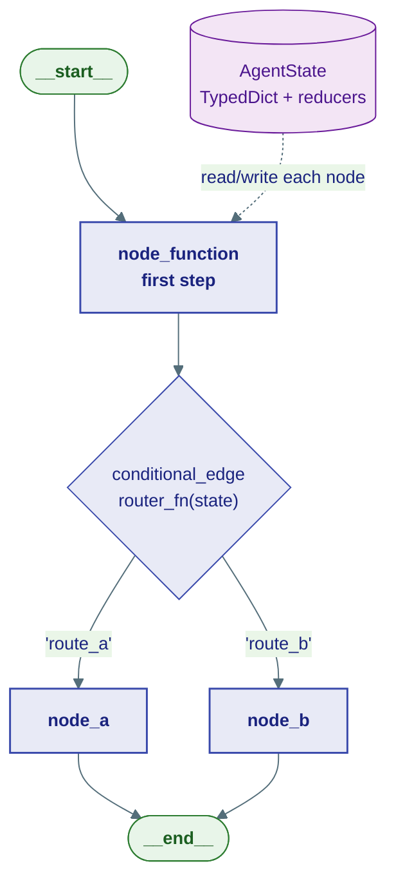

**LangGraph parallel fan-out (Send):**
```mermaid
%%{init: {'theme': 'base'}}%%
graph TB
    classDef agent fill:#E8EAF6,stroke:#3949AB,color:#1A237E,font-weight:bold

    FAN[fan_out_node\nSend() to each worker]:::agent
    FAN -->|"Send('worker', task_a)"| W1[worker_node\ntask_a]:::agent
    FAN -->|"Send('worker', task_b)"| W2[worker_node\ntask_b]:::agent
    FAN -->|"Send('worker', task_c)"| W3[worker_node\ntask_c]:::agent
    W1 -->|"result_a"| AGG[aggregate_node\nmerge results]:::agent
    W2 -->|"result_b"| AGG
    W3 -->|"result_c"| AGG
```

---

## AutoGen / AG2 {#autogen}

**Identifying markers:** `ConversableAgent`, `UserProxyAgent`, `AssistantAgent`, `GroupChat`, `GroupChatManager`, `initiate_chat`, `register_function`, `is_termination_msg`, `human_input_mode`

**Key distinctions:**
- Agents communicate by replying to messages (not state dicts)
- `UserProxyAgent` acts as human proxy — can execute code
- `GroupChatManager` selects next speaker using LLM or round-robin
- Termination via `is_termination_msg` function or `max_turns`

**Architecture template:**
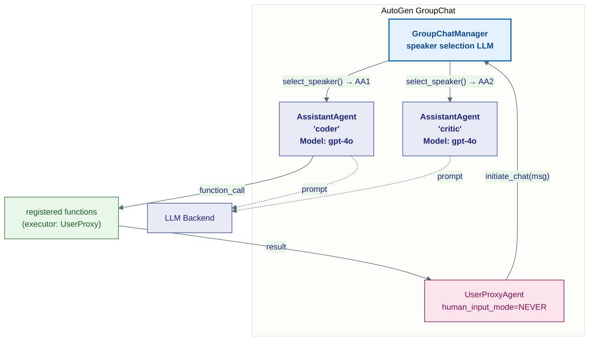

---

## CrewAI {#crewai}

**Identifying markers:** `Agent(role=, goal=, backstory=)`, `Task(description=, expected_output=, agent=)`, `Crew(agents=, tasks=, process=)`, `Process.sequential` / `Process.hierarchical`, `@tool`, `crew.kickoff()`

**Key distinctions:**
- Agents have role/goal/backstory (persona-driven)
- Tasks are discrete work units assigned to agents
- Sequential: task output becomes next task context
- Hierarchical: manager LLM routes tasks to agents

**Architecture template:**
```mermaid
%%{init: {'theme': 'base', 'themeVariables': {'primaryColor': '#E8EAF6','primaryTextColor': '#1A237E','primaryBorderColor': '#3949AB','lineColor': '#546E7A','fontSize': '14px'}}}%%
graph TB
    classDef manager fill:#E3F2FD,stroke:#1565C0,stroke-width:2px,color:#0D47A1,font-weight:bold
    classDef agent   fill:#E8EAF6,stroke:#3949AB,color:#1A237E,font-weight:bold
    classDef task    fill:#F3E5F5,stroke:#6A1B9A,color:#4A148C
    classDef tool    fill:#E8F5E9,stroke:#2E7D32,color:#1B5E20

    subgraph Crew["Crew — Process: sequential"]
        subgraph Agents["Agents"]
            A1["researcher_agent\nrole: Senior Researcher\nModel: gpt-4o"]:::agent
            A2["writer_agent\nrole: Content Writer\nModel: gpt-4o-mini"]:::agent
        end
        subgraph Tasks["Tasks"]
            T1["research_task\nassigned: researcher_agent\noutput: ResearchReport"]:::task
            T2["write_task\nassigned: writer_agent\ncontext: [research_task]"]:::task
        end
    end
    TOOLS["@tool functions"]:::tool

    KICK([kickoff(inputs)]) --> T1
    T1 --> A1
    A1 --> TOOLS
    T1 -->|"output as context"| T2
    T2 --> A2
    T2 --> OUT([Final Answer])
```

---

## Pydantic AI {#pydantic-ai}

**Identifying markers:** `Agent(model=, system_prompt=, result_type=)`, `@agent.tool`, `@agent.tool_plain`, `RunContext`, `agent.run()` / `agent.run_sync()`, `ModelRetry`, `result_validators`

**Key distinctions:**
- Agent is typed: `Agent[DepsType, ResultType]`
- Tools are typed Python functions decorated with `@agent.tool`
- `RunContext[DepsType]` gives tools access to injected dependencies
- Result is validated against `ResultType` Pydantic model
- Retries triggered by raising `ModelRetry`

**Architecture template:**
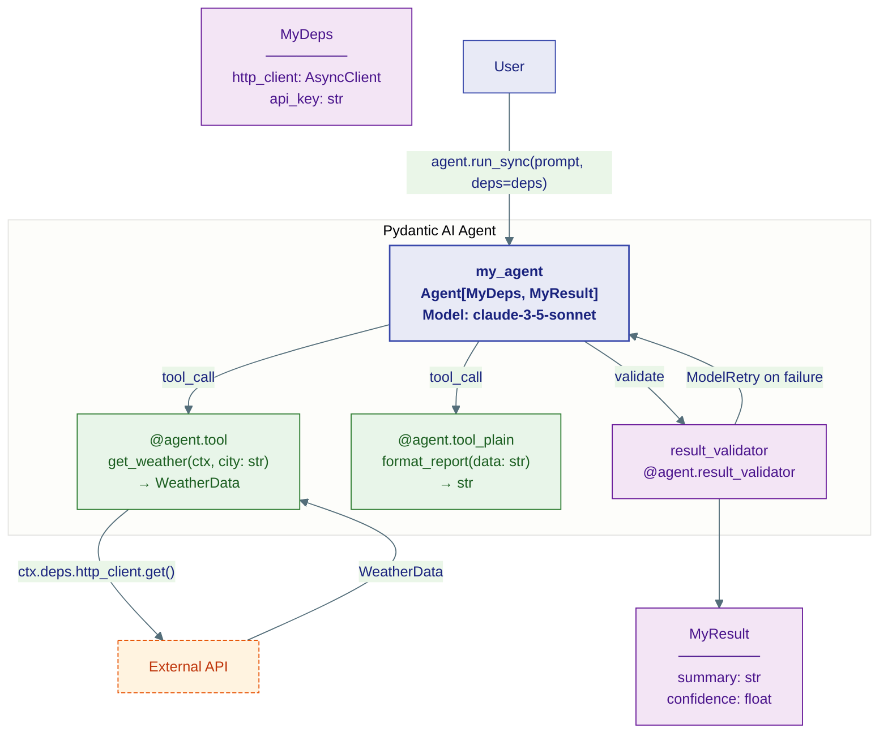

---

## DSPy {#dspy}

**Identifying markers:** `dspy.configure(lm=)`, `dspy.Signature`, `dspy.Predict`, `dspy.ChainOfThought`, `dspy.ReAct`, `dspy.Module`, `self.forward()`, `dspy.Optimizer` / `BootstrapFewShot`, `dspy.teleprompt`

**Key distinctions:**
- Signatures define input/output fields with docstrings
- Modules compose predictors (like PyTorch nn.Module)
- No explicit prompt strings — prompts are learned/optimized
- `self.forward()` is the inference method

**Architecture template:**
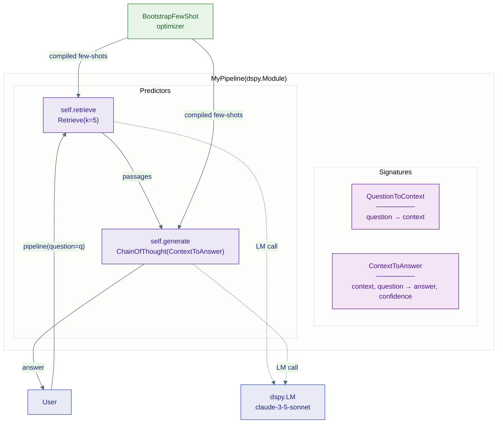

---

## Semantic Kernel {#semantic-kernel}

**Identifying markers:** `Kernel()`, `kernel.add_plugin`, `kernel.add_service`, `@kernel_function`, `KernelFunction`, `ChatCompletionAgent`, `AgentGroupChat`, `KernelArguments`, `FunctionChoiceBehavior`

**Key distinctions:**
- Plugins group related functions (like tool namespaces)
- `KernelArguments` carries context between steps
- `AgentGroupChat` coordinates multiple `ChatCompletionAgent`
- `FunctionChoiceBehavior.Auto()` enables automatic tool calling

**Architecture template:**
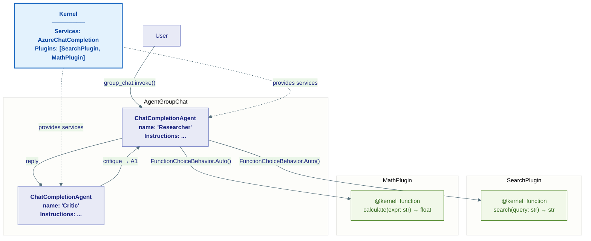

---

## LlamaIndex Agents {#llamaindex}

**Identifying markers:** `FunctionCallingAgent`, `ReActAgent`, `AgentRunner`, `QueryEngineTool`, `FunctionTool`, `from_tools()`, `agent.chat()`, `AgentChatResponse`, `QueryPipeline`

**Key distinctions:**
- Tools wrap query engines, functions, or other agents
- `ReActAgent` uses Thought/Action/Observation loop
- `FunctionCallingAgent` uses native function calling
- Can nest agents as tools inside other agents

**Architecture template:**
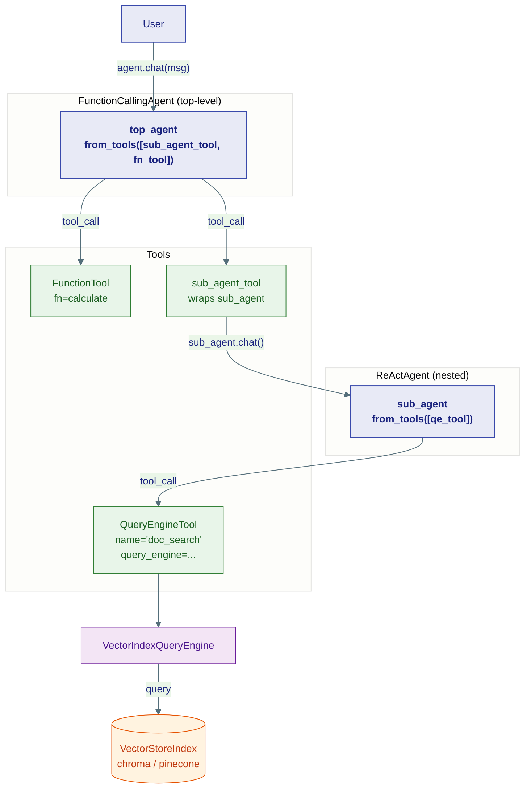

---

## OpenAI Swarm / Handoff {#swarm}

**Identifying markers:** `Agent(name=, instructions=, functions=)`, `Swarm()`, `client.run()`, `handoff` functions named `transfer_to_*`, `ContextVariables`, `Result(agent=, context_variables=)`

**Key distinctions:**
- Handoffs are Python functions that return an `Agent` object
- `ContextVariables` pass shared context between agents
- No central orchestrator — agents hand off to each other directly
- Stateless: each `client.run()` call is independent (or history passed manually)

**Sequence template:**
```mermaid
%%{init: {'theme': 'base', 'themeVariables': {'actorBkg': '#E8EAF6','actorBorder': '#3949AB','actorTextColor': '#1A237E','activationBkgColor': '#E3F2FD','activationBorderColor': '#1565C0','fontSize': '13px'}}}%%
sequenceDiagram
    autonumber
    actor User
    participant SW as Swarm client.run()
    participant TRIAGE as triage_agent
    participant SALES as sales_agent
    participant SUPPORT as support_agent

    User->>+SW: run(agent=triage_agent, messages=[...])
    SW->>+TRIAGE: invoke

    TRIAGE->>TRIAGE: classify intent
    alt sales intent detected
        TRIAGE->>SW: Result(agent=sales_agent)
        SW->>-TRIAGE: (handoff)
        SW->>+SALES: invoke with context_variables
        SALES-->>-SW: final response
    else support intent detected
        TRIAGE->>SW: Result(agent=support_agent)
        SW->>-TRIAGE: (handoff)
        SW->>+SUPPORT: invoke
        opt needs escalation
            SUPPORT->>SW: Result(agent=triage_agent)
        end
        SUPPORT-->>-SW: final response
    end
    SW-->>User: SwarmResult(messages, agent, context_variables)
```

---

## Custom ReAct Agent {#react}

**Identifying markers:** Thought/Action/Observation loop, `while not done`, tool dispatch dict, `parse_action`, `execute_tool`, scratchpad accumulation, `max_iterations` guard

**Flow template:**
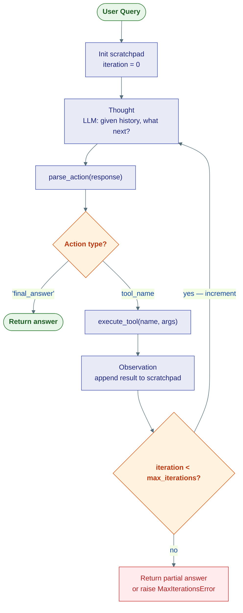

**Sequence template:**
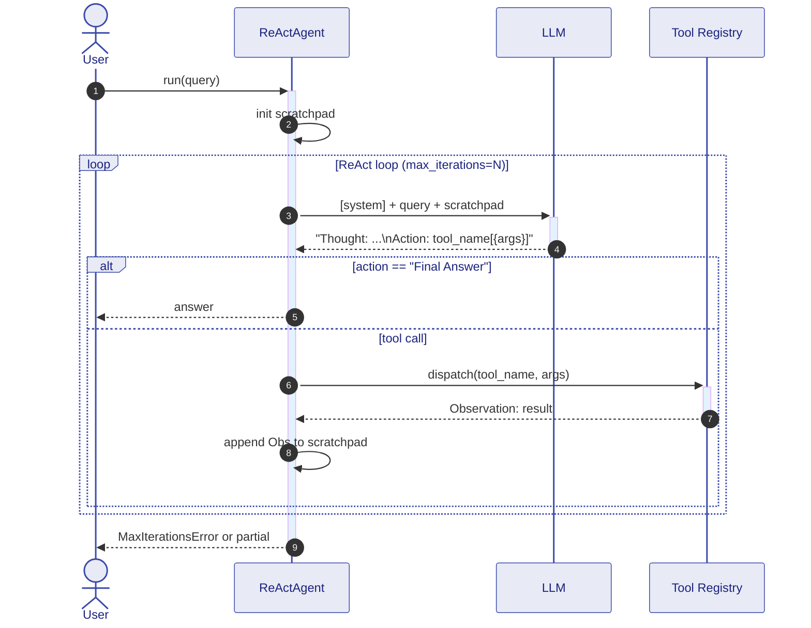

---

## RAG Pipeline Agent {#rag}

**Identifying markers:** `embed`, `similarity_search`, `vectorstore`, `retriever`, `VectorStoreRetriever`, `RetrievalQA`, `stuff_documents_chain`, `create_retrieval_chain`

**Architecture template:**
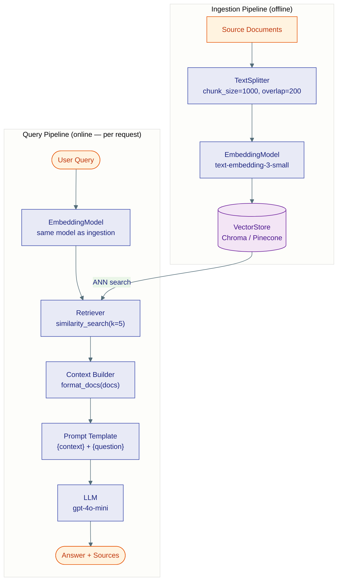

---

## Human-in-the-Loop (HITL) {#hitl}

**Identifying markers:** `interrupt()`, `interrupt_before=["node"]`, `interrupt_after=["node"]`, `human_approval`, `input()` inside node, `HumanMessage` injected mid-graph, LangGraph `breakpoint`

**Sequence template:**
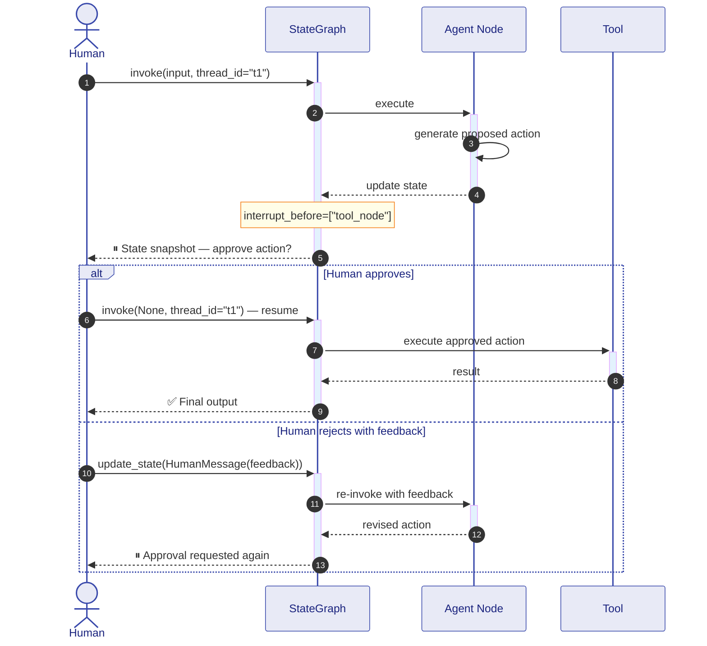

---

## Streaming Agents {#streaming}

**Identifying markers:** `agent.astream()`, `graph.astream_events()`, `AsyncIterator`, `StreamingResponse`, `stream_mode="values"` / `"updates"` / `"messages"`, `yield` inside agent function, SSE endpoints

**Architecture template:**
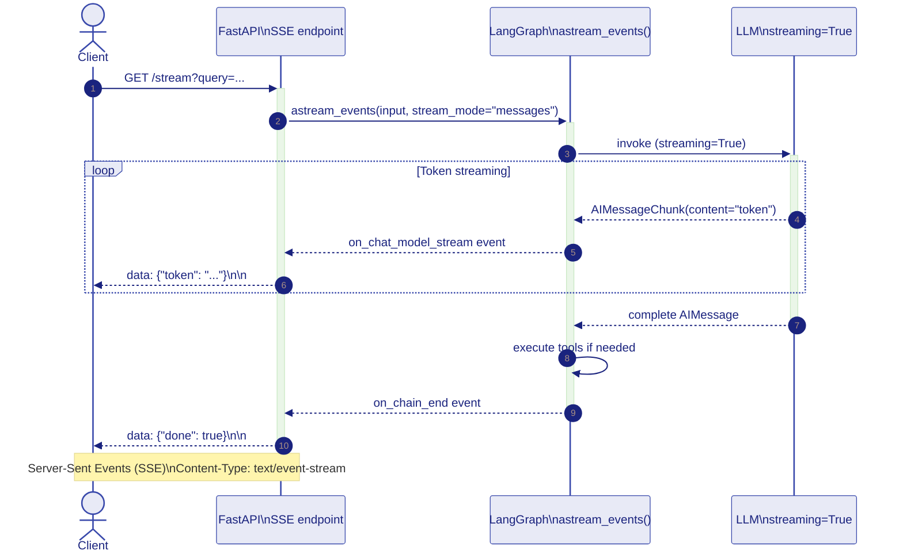

---

## Structured Output / Tool Calling {#structured-output}

**Identifying markers:** `with_structured_output(Schema)`, `bind_tools(tools)`, `tool_calls` on `AIMessage`, `ToolCall`, `JsonOutputParser`, `PydanticOutputParser`, `response_format={"type": "json_object"}`

**Flow template:**
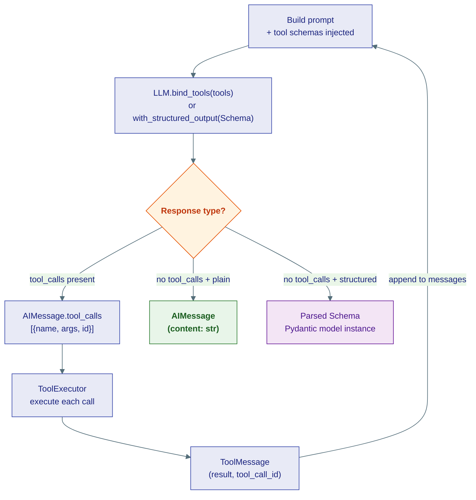