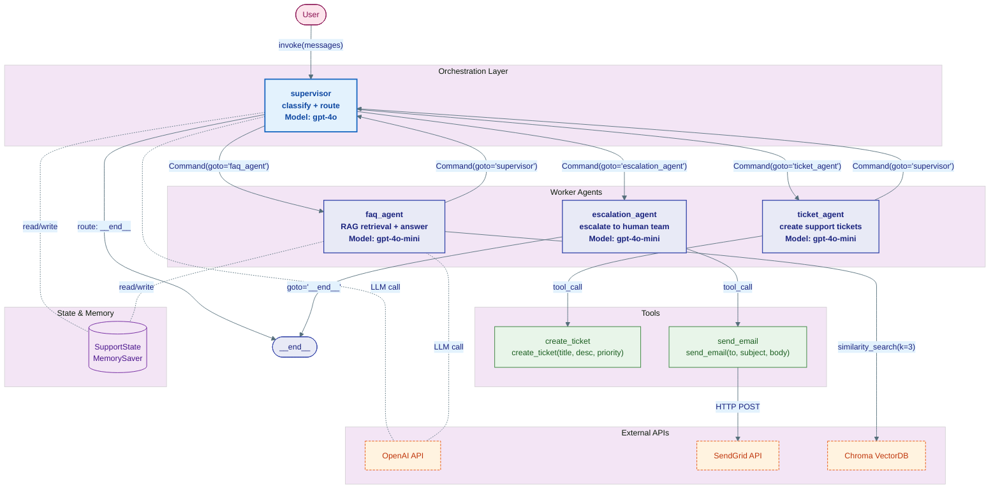
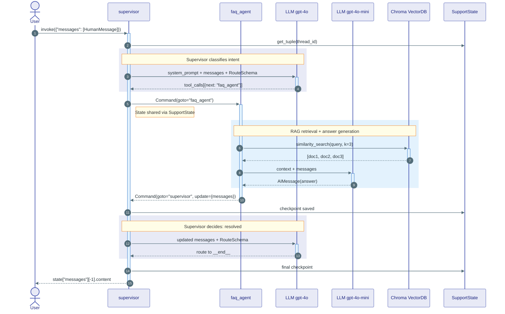
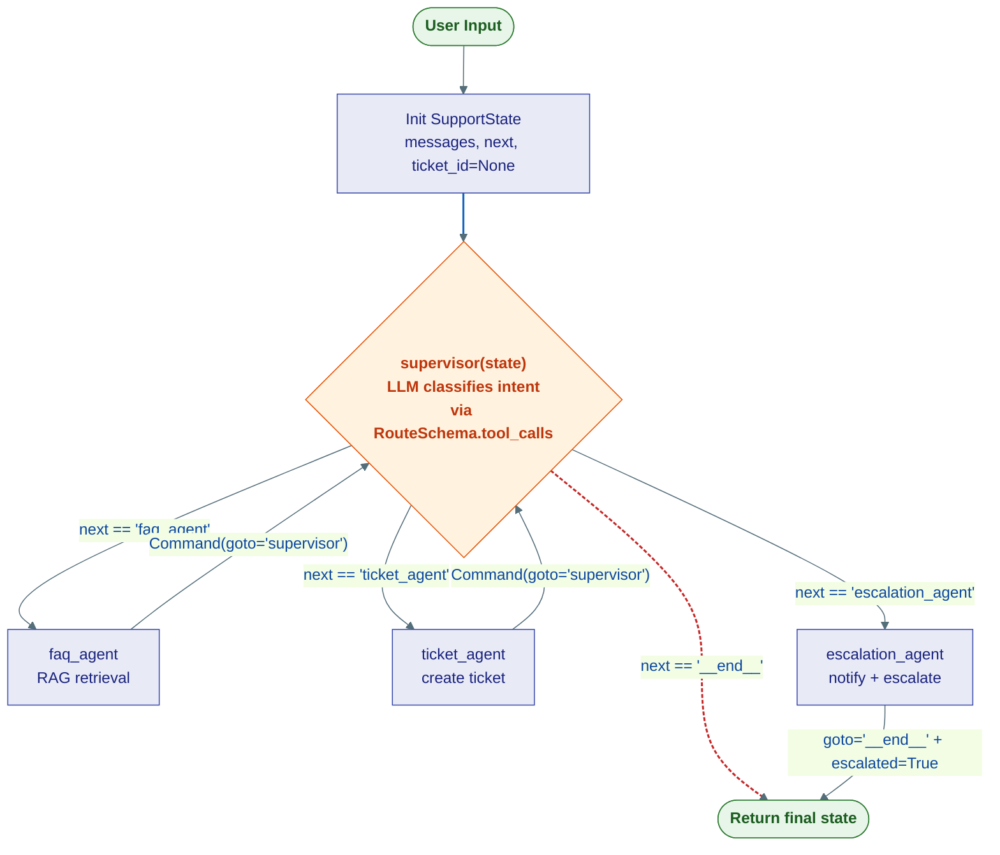

# End-to-End Example: Customer Support Multi-Agent System

> This file demonstrates the complete pipeline from source code to finished deliverable. Use this as the reference standard for output quality.

---

## Input: Source Code

### `state.py`
```python
from typing import TypedDict, Annotated, Optional
from langgraph.graph.message import add_messages
from langchain_core.messages import AnyMessage

class SupportState(TypedDict):
    messages: Annotated[list[AnyMessage], add_messages]
    next: str
    ticket_id: Optional[str]
    escalated: bool
    retry_count: int
```

### `agents.py`
```python
from langchain_openai import ChatOpenAI
from langchain_core.messages import AIMessage, SystemMessage
from langgraph.types import Command
from state import SupportState

llm_supervisor = ChatOpenAI(model="gpt-4o", temperature=0)
llm_worker = ChatOpenAI(model="gpt-4o-mini", temperature=0.3)

def supervisor(state: SupportState) -> Command:
    """Route user query to the appropriate specialist agent."""
    system = SystemMessage(content=(
        "You are a support supervisor. Classify the user query and route to:\n"
        "- 'faq_agent' for common questions\n"
        "- 'ticket_agent' for bug reports or feature requests\n"
        "- 'escalation_agent' for angry customers or complex issues\n"
        "- '__end__' if resolved"
    ))
    response = llm_supervisor.bind_tools([RouteSchema]).invoke(
        [system] + state["messages"]
    )
    next_agent = response.tool_calls[0]["args"]["next"]
    return Command(goto=next_agent, update={"next": next_agent})

def faq_agent(state: SupportState) -> Command:
    """Answer common questions using RAG retrieval."""
    docs = vector_store.similarity_search(state["messages"][-1].content, k=3)
    context = "\n".join(d.page_content for d in docs)
    system = SystemMessage(content=f"Answer using this context:\n{context}")
    response = llm_worker.invoke([system] + state["messages"])
    return Command(
        goto="supervisor",
        update={"messages": [response]}
    )

def ticket_agent(state: SupportState) -> Command:
    """Create a support ticket from the conversation."""
    response = llm_worker.bind_tools([create_ticket]).invoke(state["messages"])
    if response.tool_calls:
        ticket = create_ticket(**response.tool_calls[0]["args"])
        return Command(
            goto="supervisor",
            update={"messages": [response], "ticket_id": ticket.id}
        )
    return Command(goto="supervisor", update={"messages": [response]})

def escalation_agent(state: SupportState) -> Command:
    """Escalate to human support and notify via email."""
    send_email(
        to="support-team@company.com",
        subject=f"Escalation: {state['messages'][0].content[:50]}",
        body=format_conversation(state["messages"])
    )
    response = AIMessage(content="I've escalated your case to our senior support team. They'll reach out within 2 hours.")
    return Command(
        goto="__end__",
        update={"messages": [response], "escalated": True}
    )
```

### `tools.py`
```python
from langchain_core.tools import tool
from langchain_chroma import Chroma
from langchain_openai import OpenAIEmbeddings

vector_store = Chroma(
    collection_name="faq_docs",
    embedding_function=OpenAIEmbeddings(model="text-embedding-3-small")
)

@tool
def create_ticket(title: str, description: str, priority: str) -> dict:
    """Create a support ticket in the ticketing system."""
    # Calls internal API
    return {"id": "TICK-1234", "status": "created"}

@tool
def send_email(to: str, subject: str, body: str) -> str:
    """Send an email notification via SendGrid."""
    # Calls SendGrid API
    return "sent"
```

### `graph.py`
```python
from langgraph.graph import StateGraph, START, END
from langgraph.checkpoint.memory import MemorySaver
from state import SupportState
from agents import supervisor, faq_agent, ticket_agent, escalation_agent

builder = StateGraph(SupportState)
builder.add_node("supervisor", supervisor)
builder.add_node("faq_agent", faq_agent)
builder.add_node("ticket_agent", ticket_agent)
builder.add_node("escalation_agent", escalation_agent)

builder.add_edge(START, "supervisor")
# Routing is handled dynamically via Command(goto=...) in each agent

checkpointer = MemorySaver()
graph = builder.compile(checkpointer=checkpointer)
```

---

## Expected Output: Complete Deliverable

---

# Agent System Architecture Documentation
**Generated:** 2026-04-10  **Analyzer:** Claude (agent-mermaid skill)
**Source:** `state.py`, `agents.py`, `tools.py`, `graph.py`
**Framework:** LangGraph
**Pattern:** Supervisor/Worker

## System Inventory
| Category | Count | Names |
|---|---|---|
| Agents | 4 | supervisor, faq_agent, ticket_agent, escalation_agent |
| Tools | 2 | create_ticket, send_email |
| LLM Models | 2 | gpt-4o (supervisor), gpt-4o-mini (workers) |
| State Fields | 5 | messages, next, ticket_id, escalated, retry_count |
| External APIs | 3 | OpenAI API, SendGrid API, Chroma VectorDB |
| Memory/Persistence | MemorySaver | In-memory checkpointer |

## Architecture Summary
A customer support multi-agent system using LangGraph's Supervisor/Worker pattern. The supervisor classifies incoming queries and routes to three specialized workers: FAQ (RAG-based retrieval), Ticket Creation, and Human Escalation. All agents share mutable state via `SupportState` TypedDict with `add_messages` reducer.

## Diagram Index
| # | Type | Title | Key question answered |
|---|---|---|---|
| 1 | Architecture | Customer Support System Overview | What exists and how is it connected? |
| 2 | Sequence | Happy Path: FAQ Query Resolution | What happens at runtime, step by step? |
| 3 | Flow | Supervisor Routing Logic | How does routing/decision logic work? |
| 5 | Data/State | SupportState Transformation Pipeline | How does state evolve through the system? |
| 7 | Error/Recovery | Retry & Fallback Paths | What happens when things go wrong? |

---

**📌 Diagram 1 — Architecture: Customer Support System Overview**

> **Cross-ref:** Sequence §2 shows runtime flow through these components; Flow §3 details supervisor routing decision
> **Derived from:** `graph.py` · `StateGraph` construction · lines 1–14; `agents.py` · all agent functions; `tools.py` · tool definitions

```python
# graph.py — Graph construction (critical structural code)
builder = StateGraph(SupportState)
builder.add_node("supervisor", supervisor)        # Routes to workers
builder.add_node("faq_agent", faq_agent)          # RAG-based FAQ
builder.add_node("ticket_agent", ticket_agent)    # Ticket creation
builder.add_node("escalation_agent", escalation_agent)  # Human escalation
builder.add_edge(START, "supervisor")
graph = builder.compile(checkpointer=MemorySaver())
```



> **Reading guide:** This diagram reveals the asymmetric agent topology — `escalation_agent` bypasses the supervisor loop and goes directly to `__end__`, unlike the other workers which return to the supervisor. This is a deliberate architectural choice for urgent escalations.

> **Inferences:** All relationships explicit in source. The LLM call connections (dashed) from FAQ and SUP to OpenAI API are inferred from `ChatOpenAI` instantiation in `agents.py`.

---

**📌 Diagram 2 — Sequence: Happy Path — FAQ Query Resolution**

> **Cross-ref:** Architecture §1 shows static structure; Flow §3 details the supervisor's routing conditions
> **Derived from:** `agents.py` · `supervisor()` lines 11–20, `faq_agent()` lines 22–31

```python
# agents.py — Supervisor routing decision
response = llm_supervisor.bind_tools([RouteSchema]).invoke(
    [system] + state["messages"]
)
next_agent = response.tool_calls[0]["args"]["next"]
return Command(goto=next_agent, update={"next": next_agent})

# agents.py — FAQ agent RAG retrieval
docs = vector_store.similarity_search(state["messages"][-1].content, k=3)
context = "\n".join(d.page_content for d in docs)
response = llm_worker.invoke([system] + state["messages"])
return Command(goto="supervisor", update={"messages": [response]})
```



> **Reading guide:** The two-pass supervisor pattern is clearly visible — the supervisor is called twice (steps 3–4 and 13–14), first to route to FAQ, then to confirm resolution. Each supervisor call requires an LLM invocation, making this a 3-LLM-call flow minimum.

> **Inferences:** All relationships explicit in source. The checkpoint timing (steps 8, 12, 15) is inferred from MemorySaver's default behavior of checkpointing after each node execution.

---

**📌 Diagram 3 — Flow: Supervisor Routing Logic**

> **Cross-ref:** Architecture §1 identifies the four agents; Sequence §2 shows one path through this logic
> **Derived from:** `agents.py` · `supervisor()` · lines 11–20

```python
# agents.py — The routing decision
response = llm_supervisor.bind_tools([RouteSchema]).invoke(
    [system] + state["messages"]
)
next_agent = response.tool_calls[0]["args"]["next"]
# next_agent ∈ {"faq_agent", "ticket_agent", "escalation_agent", "__end__"}
return Command(goto=next_agent, update={"next": next_agent})
```



> **Reading guide:** The asymmetry is clearly visible — `escalation_agent` is a terminal path (exits directly to `__end__`), while `faq_agent` and `ticket_agent` loop back to the supervisor. This means escalated cases cannot be de-escalated within the current architecture. Also note: there is no explicit `max_iterations` guard on the supervisor loop — in theory, the supervisor could loop indefinitely between workers.

> **Inferences:** All relationships explicit in source. The absence of a loop guard is a finding from code analysis, not an inference.

---

**📌 Diagram 5 — Data/State: SupportState Transformation Pipeline**

> **Cross-ref:** Architecture §1 shows SupportState as central storage; Sequence §2 shows read/write timing
> **Derived from:** `state.py` · `SupportState` TypedDict; `agents.py` · Command update dicts

```mermaid
%%{init: {'theme': 'base', 'themeVariables': {'primaryColor': '#F3E5F5','primaryTextColor': '#4A148C','primaryBorderColor': '#6A1B9A','lineColor': '#546E7A','fontSize': '14px'}}}%%
flowchart LR
    classDef schema    fill:#F3E5F5,stroke:#6A1B9A,color:#4A148C
    classDef transform fill:#E8F5E9,stroke:#2E7D32,color:#1B5E20
    classDef io        fill:#FFF3E0,stroke:#E65100,color:#BF360C

    IN["HumanMessage<br/>────────<br/>content: str<br/>role: human"]:::io
    S1["SupportState (init)<br/>────────<br/>messages: [HumanMessage]<br/>next: ''<br/>ticket_id: None<br/>escalated: False<br/>retry_count: 0"]:::schema
    S2["After supervisor<br/>────────<br/>next: 'faq_agent'<br/>messages: appended"]:::schema
    S3["After faq_agent<br/>────────<br/>messages: +AIMessage<br/>next: unchanged"]:::schema
    S4["After supervisor (2nd)<br/>────────<br/>next: '__end__'"]:::schema
    OUT["Final output<br/>────────<br/>messages[-1].content"]:::io

    IN -->|"invoke() wraps"| S1
    S1 -->|"supervisor routes"| S2
    S2 -->|"worker processes"| S3
    S3 -->|"supervisor confirms"| S4
    S4 -->|"__end__ reached"| OUT
```



> **Reading guide:** The `add_messages` reducer on the `messages` field means messages are appended, never overwritten. The `ticket_id` and `escalated` fields are set exactly once and serve as cross-cutting metadata, not flow control variables.

> **Inferences:** All relationships explicit in source.

---

## Architectural Notes & Risks

### Strengths
- Clean Supervisor/Worker separation — supervisor handles only routing, not business logic
- `add_messages` reducer prevents accidental message overwrites
- MemorySaver enables conversation resumption across invocations
- Escalation path bypasses supervisor loop — appropriate for urgent cases

### Risks & Anti-patterns Found
| Risk | Severity | Location | Recommendation |
|---|---|---|---|
| No iteration cap on supervisor loop | High | `graph.py` — no `recursion_limit` set | Add `graph.compile(checkpointer=checkpointer, recursion_limit=25)` |
| `retry_count` declared but never used | Medium | `state.py:7` | Implement retry logic in agent functions or remove field |
| API key likely hardcoded or env-dependent | Low | `tools.py` — `OpenAIEmbeddings()` | Verify API keys use env vars |
| `RouteSchema` not in provided files | Info | `agents.py:17` — `bind_tools([RouteSchema])` | RouteSchema definition missing — inferred as a Pydantic model |

### Assumptions & Inferences
- `RouteSchema` is inferred as a Pydantic model with a `next: str` field based on `response.tool_calls[0]["args"]["next"]` usage
- Checkpoint timing inferred from LangGraph's default behavior (checkpoint after each node)
- `vector_store` in `faq_agent` is assumed to be the same `Chroma` instance from `tools.py` (imported but not shown)
- Worker agents (`faq_agent`, `ticket_agent`, `escalation_agent`) all use `llm_worker` (gpt-4o-mini) based on code — this is explicit, not inferred
